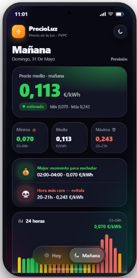
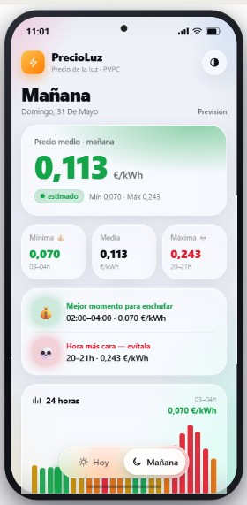

<div align="center">

# ⚡ PrecioLuz App

### *El precio de la luz en tu bolsillo*


<br/>

</div>

---

## 🌟 ¿Qué es?

**PrecioLuz App** es una app Android nativa que muestra el **precio de la luz en España (PVPC)** en tiempo real, con un diseño espectacular basado en **Material 3** y **dynamic color**.

> 💡 Gráfico interactivo por horas, notificaciones inteligentes y modo offline-first. Todo lo que necesitas para ahorrar en tu factura de la luz.

---

## ✨ Características

| Feature | Descripción |
|---------|-------------|
| 📊 **Gráfico 24h** | Barras interactivas con colores por cuartil (verde barato → rojo caro) |
| 💰 **Mejor hora** | Te dice cuándo enchufar para ahorrar |
| ⚠️ **Peor hora** | Evita los picos de precio |
| 📱 **Dark mode** | Soporte completo con dynamic color (Material You) |
| 🔔 **Notificaciones** | Precios de mañana ~20:30 y resumen diario a las 08:00 |
| ⚡ **Offline-first** | Los datos se cachean en Room, solo 1 llamada API por día |
| 🌓 **Tema automático** | Se adapta al modo claro/oscuro del sistema |

---

## 🛠️ Tech Stack

```
├── 🎨  Jetpack Compose   · UI declarativa + Material 3
├── 🟣  Kotlin 2.x        · Lenguaje principal
├── 🏗️  MVVM + StateFlow  · Arquitectura reactiva
├── 🗄️  Room              · Cache offline (SQLite)
├── 🌐  Retrofit + OkHttp  · Conexión a la API de REE
├── 🔧  Hilt              · Dependency injection
├── 💾  DataStore          · Preferencias del usuario
├── ⏰  WorkManager        · Notificaciones programadas
└── 📡  REE ESIOS API     · Fuente oficial de datos
```

---

## 📸 Vista previa

<div align="center">

| 🌙 Modo Oscuro | ☀️ Modo Claro |
|:--------------:|:-------------:|
|  |  |

</div>

---

## 🚀 Uso rápido

1. **Abre** la app y verás el gráfico de precios de hoy
2. **Toca** las barras para ver el precio desglosado de cada hora
3. **Navega** entre Hoy y Mañana con la pestaña superior
4. **Descubre** el mejor momento para usar electrodomésticos de alto consumo
5. **Configura** las notificaciones en Ajustes

---

## 📡 API — Red Eléctrica de España

La app usa el indicador **1001** (PVPC 2.0TD) de la API de REE ESIOS.

| Parámetro | Valor |
|-----------|-------|
| Endpoint | `GET https://api.esios.ree.es/indicators/1001` |
| Auth | Header `x-api-key: <ESIOS_API_TOKEN>` |
| Zona | `geo_id = 8741` (Península) |
| Conversión | EUR/MWh ÷ 1000 = EUR/kWh |
| Datos mañana | Disponibles ~20:30 CET |

> 🔑 Se requiere una API key personal. Solicítala en `api_token@ree.es`.

---

## 📂 Estructura

```
app/src/main/java/com/precioluz/app/
├── 📁  data/
│   ├── 🗄️  local/          · Room DAOs, entities, DataStore
│   ├── 🌐  network/        · Retrofit interface, DTOs
│   └── 📦  repository/     · PriceRepository impl
├── 🧠  domain/
│   ├── 📋  model/          · PriceHour, PriceDay
│   └── ⚙️  usecase/        · GetPricesUseCase
├── 🎨  ui/
│   ├── 🏠  home/           · HomeScreen, HomeViewModel
│   ├── ⚙️  settings/       · SettingsScreen, SettingsViewModel
│   └── 🎭  theme/          · Material 3 theme, color tiers
├── ⏰  worker/             · PriceSyncWorker, NotificationWorker
└── 🔧  di/                 · Hilt modules
```

---

## 🔔 Notificaciones

| Notificación | Hora | Descripción |
|-------------|------|-------------|
| 🌙 Precios de mañana | ~20:30 CET | Aviso cuando se publican los precios del día siguiente (con retries) |
| ☀️ Resumen del día | 08:00 CET | Resumen con la hora más barata y la media del día |

Ambas se pueden activar/desactivar desde **Ajustes**. No requieren servidor ni Firebase.

---

## ⚙️ Configuración

### Requisitos

- Android Studio Hedgehog o superior
- JDK 17+
- Android SDK 35

### API Key

```bash
# Copia el template
cp local.properties.template local.properties

# Añade tu token
echo "ESIOS_API_TOKEN=tu_token_aqui" >> local.properties
```

> ⚠️ `local.properties` está en `.gitignore` y **nunca** se commitea al repo.

### Build

```bash
# Debug
./gradlew assembleDebug

# Release
./gradlew assembleRelease
```

---

## 🤝 Contribuir

¡Las contribuciones son bienvenidas!

1. 🍴 Fork el proyecto
2. 🌿 Crea una rama (`git checkout -b feature/nueva-feature`)
3. 💾 Commit tus cambios (`git commit -m 'Add nueva feature'`)
4. 📤 Push a la rama (`git push origin feature/nueva-feature`)
5. 🔀 Abre un Pull Request

---

## 📄 Licencia

Este proyecto está bajo la licencia **CC BY-NC-SA 4.0** — véase el archivo [LICENSE](LICENSE) para más detalles.

---

<div align="center">

Hecho con ❤️ y ⚡ para ahorrar dinero y energía por **[Hugo Perez-Vigo](https://hugopvigo.es)** ([@hugopvigo](https://twitter.com/hugopvigo))

**[⬆ Volver arriba](#-precioluz-app)**

</div>
